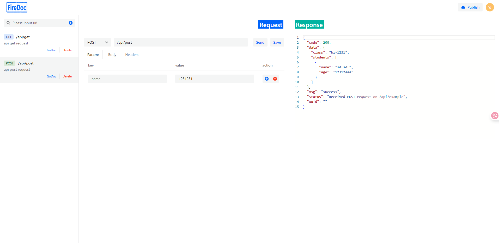

# fire-doc

fire-doc is a streamlined integration of postman and swagger. Unlike Swagger, which necessitates extensive annotation code, and unlike postman, which mandates downloading, installing, logging in, and registering, fire-doc merely requires altering a single line of code to facilitate interface documentation and debugging.

## fire-doc vs swagger
 
- **Simple**: No need to write code comments
- **Better Experience** : The page experience is better than swagger

## fire-doc vs postman
- **Simple**: No additional software installation required
- **Better Experience**: fire-doc does not require login or registration, just open the page and use it

## 🚀 Installation


### Quick Start

1. Install the fire-doc package:
```powershell
go get github.com/dage212/fire-doc/firedoc@latest
```

2. Configure the route /fire-doc/* to support all HTTP methods for /fire-doc/*. Implementation details may vary slightly between frameworks—refer to the Usage Examples for specific code. The same approach applies to other frameworks not listed.
```powershell
r.Any("/fire-doc/*path", gin.WrapH(http.HandlerFunc(firedoc.FireDocIndexHandler)))
```
3. Run the fire-doc, port is your local service port:
```
open localhost:8080/fire-doc/
```   
4. Open the page and enjoy it
   



## 🎯 Code Examples

**Gin Usage Examples**
```go
package main

import (
	"fmt"
	"net/http"

	"github.com/dage212/fire-doc/firedoc"
	"github.com/gin-gonic/gin"
)

type Example struct {
	Class    string    `json:"class"`
	Students []Student `json:"students"`
}

type Student struct {
	Name string `json:"name"`
	Age  string `json:"age"`
}

func main() {
	fmt.Println("Starting server...", firedoc.Dir())
	r := gin.Default()
	r.GET("/api/get", func(c *gin.Context) {
		name, _ := c.GetQuery("name")
		c.SetSameSite(http.SameSiteNoneMode)
		c.SetCookie("tokensv", "example-token", 3600, "/", "", true, true)
		c.JSON(200, gin.H{
			"message": "Hello, World!",
			"name":    name,
		})
	})
	r.POST("/api/post", func(c *gin.Context) {
		uuid, _ := c.GetQuery("uuid")
		var example Example
		if err := c.ShouldBindJSON(&example); err == nil {
			c.JSON(200, gin.H{
				"code:":  200,
				"status": "success",
				"data": gin.H{
					"data": example,
					"uuid": uuid,
				},
				"message": "Received POST request on /api/example",
			})
		} else {
			c.JSON(400, gin.H{
				"code:":   400,
				"status":  "error",
				"message": err.Error(),
			})
		}
	})

	r.POST("/api/raw", func(c *gin.Context) {

		rawData, err := c.GetRawData()
		if err != nil {
			c.JSON(400, gin.H{
				"code":    400,
				"status":  "error",
				"message": "Failed to read request body",
			})
			return
		}

		strData := string(rawData)

		c.JSON(200, gin.H{
			"code":    200,
			"status":  "success",
			"data":    strData,
			"message": "Successfully received raw string data",
		})
	})
	// TIPS: example start
	// r.Static("/fire-doc", firedoc.Dir())
	// TIPS: example end
	r.Any("/fire-doc/*path", gin.WrapH(http.HandlerFunc(firedoc.FireDocIndexHandler)))
	r.Run()
}


```
**Echo Usage Examples**
```go
e.Any("/fire-doc/*", echo.WrapHandler(http.HandlerFunc(firedoc.FireDocIndexHandler)))
```
**Fiber Usage Examples**
```go
app.All("/fire-doc/*", adaptor.HTTPHandler(http.HandlerFunc(firedoc.FireDocIndexHandler)))
```

**Chi Usage Examples**
```go
r.Handle("/fire-doc/*", http.HandlerFunc(firedoc.FireDocIndexHandler))
```
**GoFrame Usage Examples**
```go
s.BindHandler("/fire-doc/*path", func(r *ghttp.Request) {
		firedoc.FireDocIndexHandler(r.Response.Writer, r.Request)
	})
```
**Beego Usage Examples**
```go
web.Handler("/fire-doc/*", http.HandlerFunc(firedoc.FireDocIndexHandler))
```
